# Medium Makalesi — Mermaid Diyagramları

[medium-mimari-makale.md](medium-mimari-makale.md) içindeki ASCII şemaların Mermaid karşılıkları.

**Kullanım:** GitHub bu blokları doğrudan render eder. Medium mermaid desteklemediği için
her bloğu [mermaid.live](https://mermaid.live) sitesine yapıştırıp PNG/SVG olarak dışa aktarın
ve makaleye görsel olarak gömün (`mmdc` CLI ile toplu export da mümkün:
`mmdc -i medium-mimari-diagramlar.md -o cikti.png`).

---

## 1. Büyük Resim

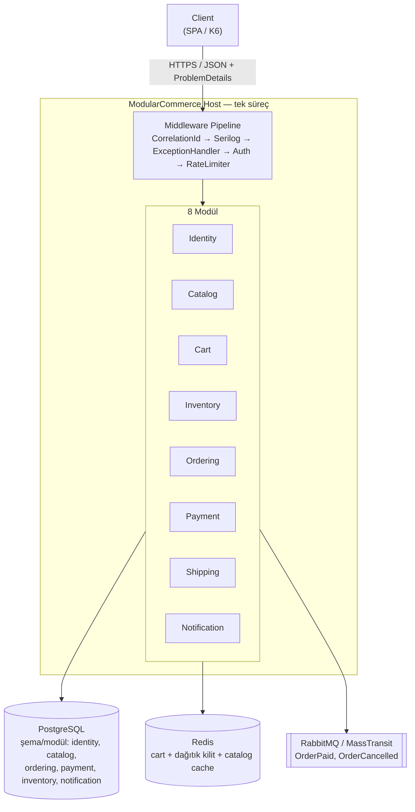

---

## 2. Modül Katmanları ve Referans Yönü

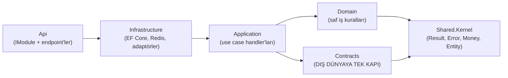

---

## 3. Modüller Arası Konuşma: Ordering → Cart Örneği

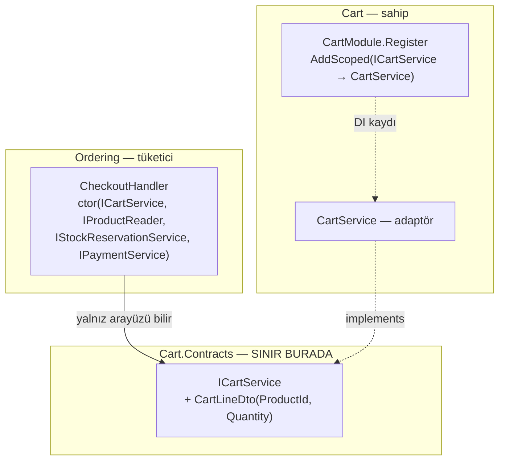

---

## 4. Sınır İstisnası: Ters Yön Bağımlılığı (Döngüsüz)

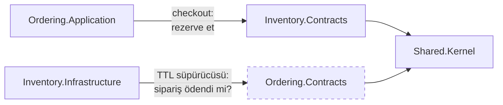

Contracts projeleri geriye hiçbir modüle referans vermez → graf **asiklik** kalır.

---

## 5. Middleware Boru Hattı

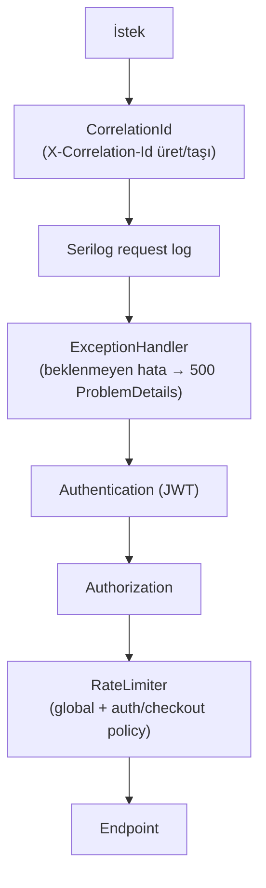

---

## 6. Kimlik: Signup → Login

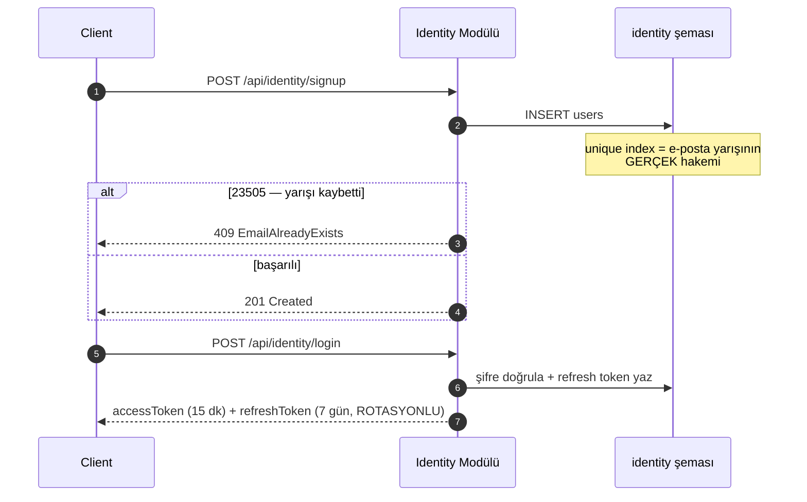

---

## 7. Catalog: Cache'li Okuma (Decorator)

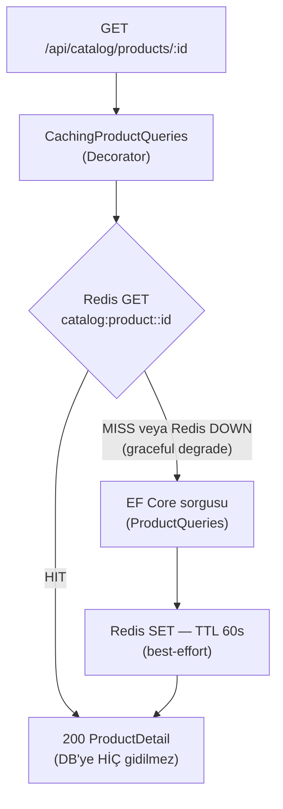

---

## 8. Sepet: Redis-Only

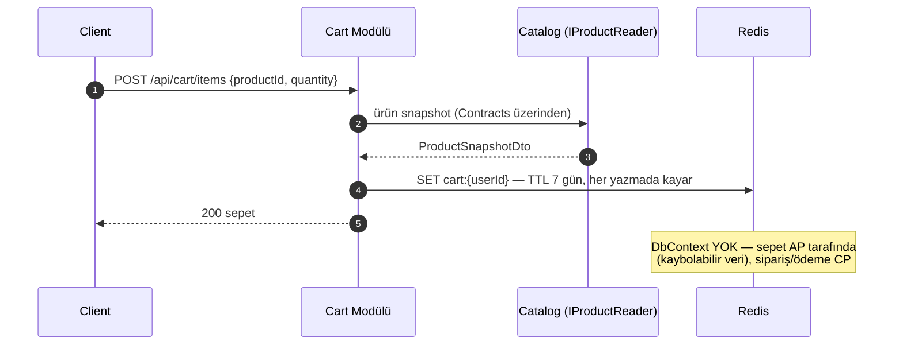

---

## 9. Checkout (Ana Olay)

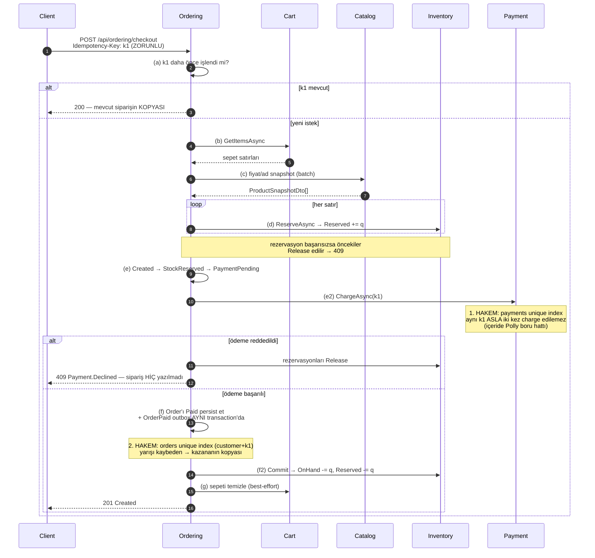

---

## 10. Payment İçi Dayanıklılık: Polly Boru Hattı

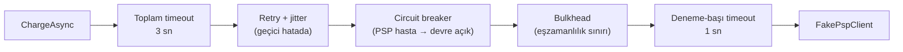

---

## 11. Asenkron Akış: Outbox → RabbitMQ → Idempotent Inbox → DLQ

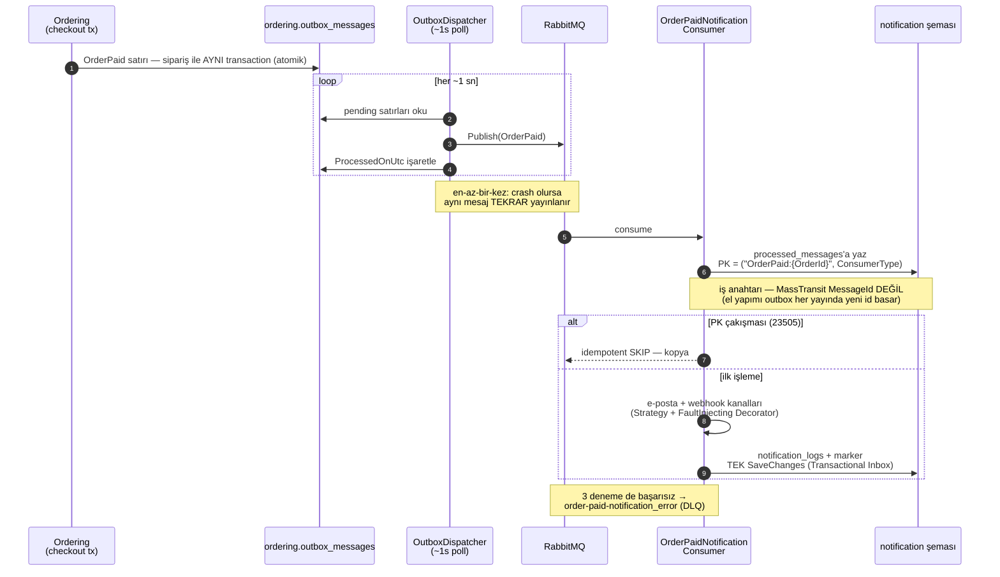

---

## 12. İptal ve Telafi

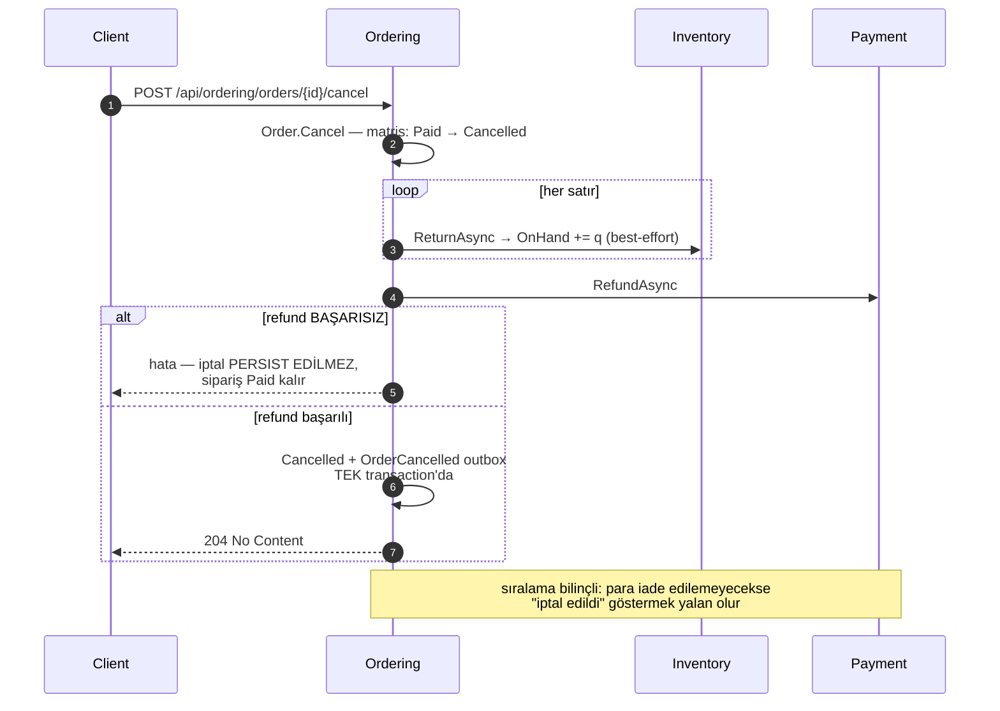

---

## 13. TTL Süpürücüsü (Self-Healing)

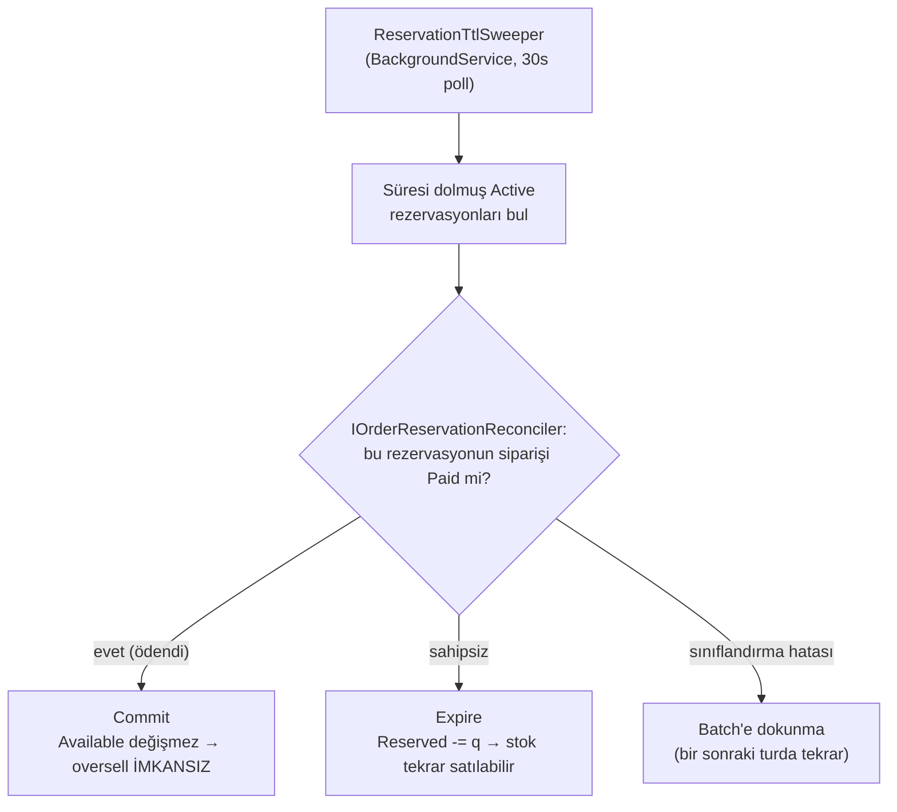

---

## 14. Order Durum Makinesi

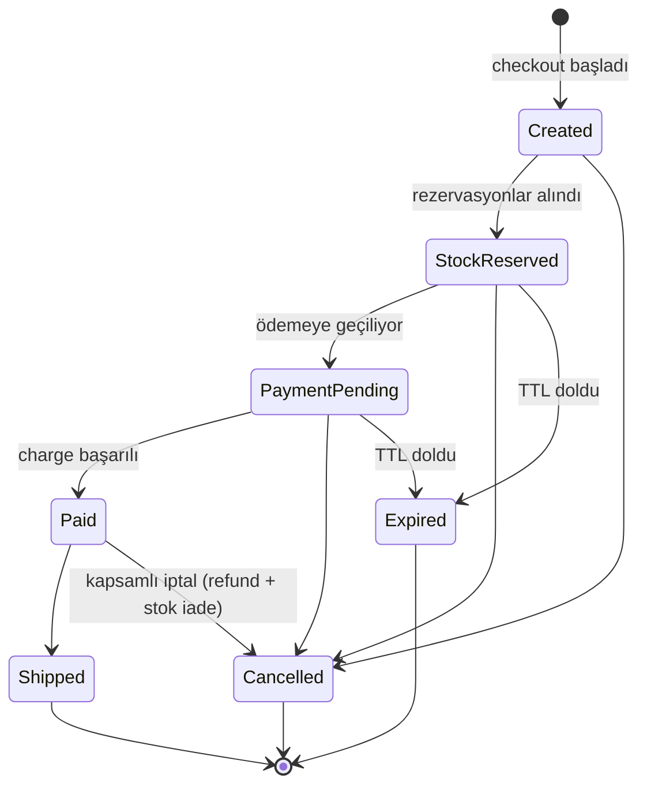

---

## 15. Aggregate Yapıları

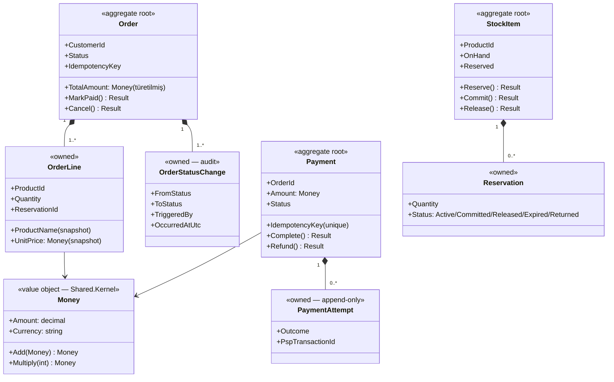
