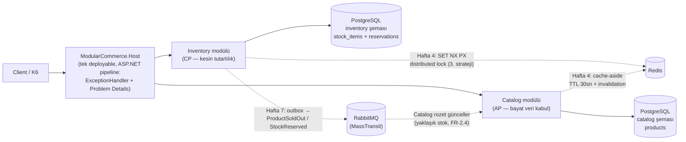
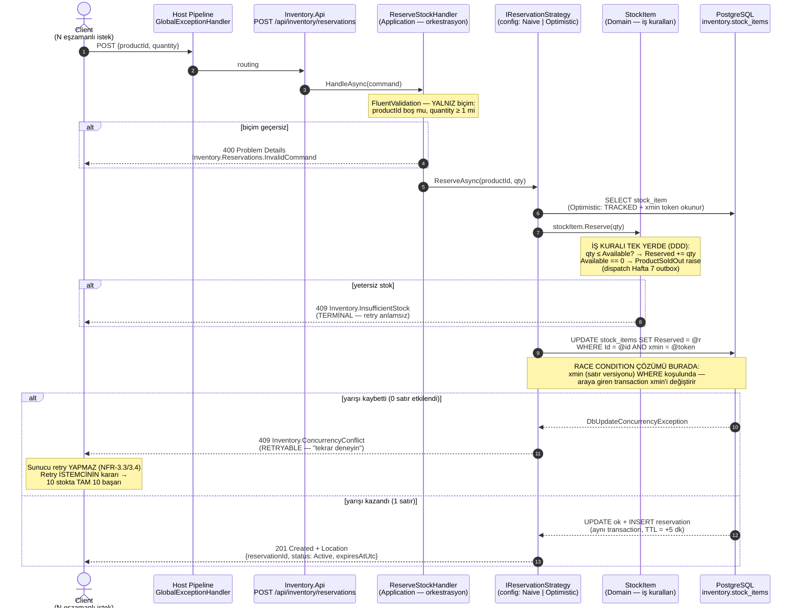
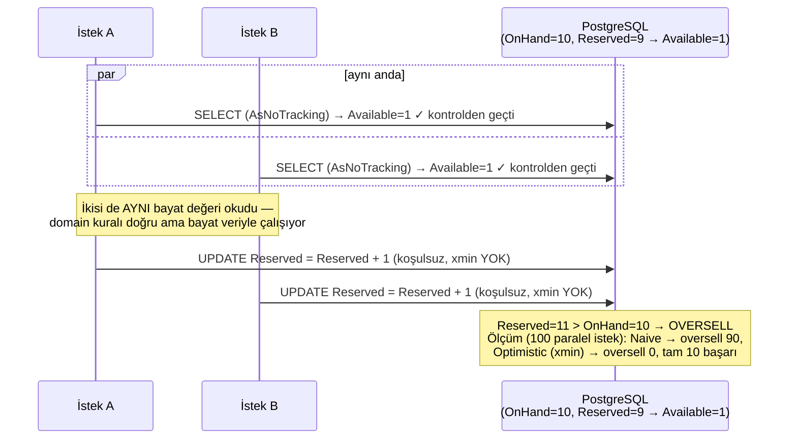

# Rezervasyon Akış Diyagramları — Uçtan Uca (Hafta 3 durumu + gelecek haftalar)

> Sistem tasarımı anlatısı: bir rezervasyon isteğinin Client'tan PostgreSQL'e yolculuğu,
> race condition'ın nerede doğduğu ve hangi katmanda çözüldüğü.
> Kesikli oklar henüz gelmemiş parçalardır (Redis: Hafta 4, RabbitMQ/outbox: Hafta 7).

## 1. Büyük resim — topoloji

Sınır kuralı: modüller birbirinin şemasına SQL atamaz; Inventory stok gerçeğinin tek sahibi,
Catalog'daki stok yalnızca event'le beslenen yaklaşık kopya olacak.

## 2. Rezervasyon isteği — uçtan uca sekans (bugünkü kod)

## 3. Yarışın anatomisi — Naive neden oversell yapar

Klasik **check-then-act** hatası: kontrol ile yazma arasında dünya değişir.

## Çözüm katmanları özeti (mülakat cevabı)

| Katman | Ne yapar | Neden tek başına yetmez |
|---|---|---|
| 1. Domain invariant (`StockItem.Reserve`) | `qty ≤ Available` kuralı — her stratejide çalışır | Bayat snapshot'a karşı çalışırsa yarışı GÖREMEZ (naive'in dersi) |
| 2. **Optimistic concurrency (xmin)** ← Hafta 3 | `UPDATE ... WHERE xmin=@token`; kaybeden 409 alır | Çakışma oranı aşırı yükselirse retry trafiği büyür |
| 3. Redis distributed lock ← Hafta 4 | `SET key NX PX` ile ürün başına kilit; yarış hiç başlamaz | Ek altyapı + kilit bekleme gecikmesi; ölçümle karşılaştırılacak |
| İlke (NFR-3.4) | Belirsizlikte REDDET, asla iyimser onay verme; sunucu retry yok, retry istemcinin | — |

İki 409'un ayrımı istemci sözleşmesinin parçası: `Inventory.ConcurrencyConflict` = tekrar dene,
`Inventory.InsufficientStock` = dur, stok bitti (ProblemDetails `title` alanından ayırt edilir).
